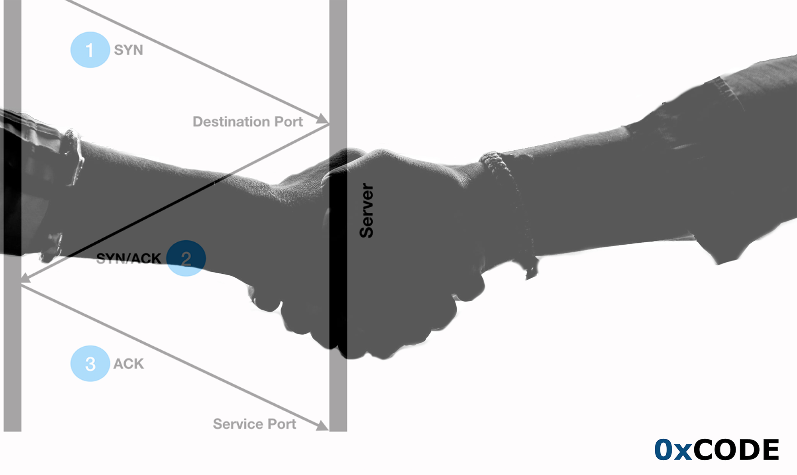
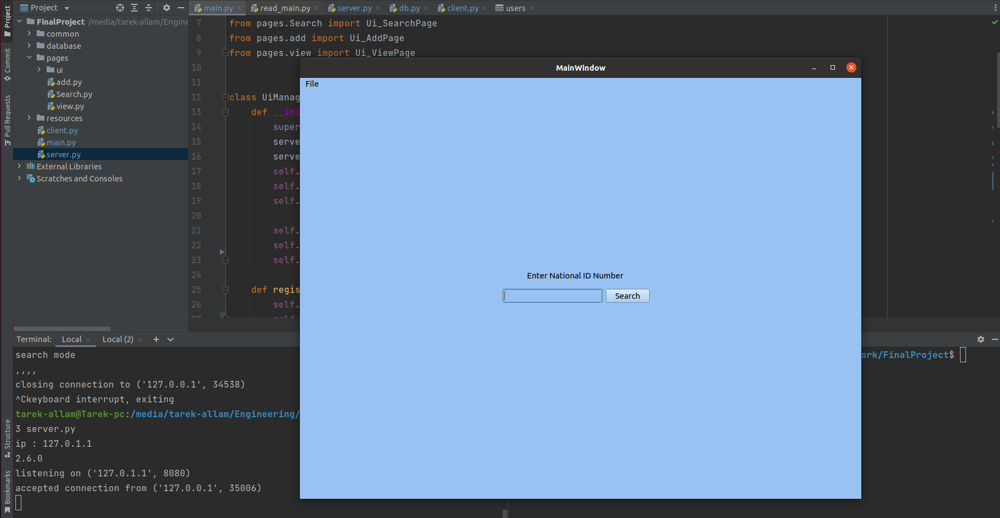
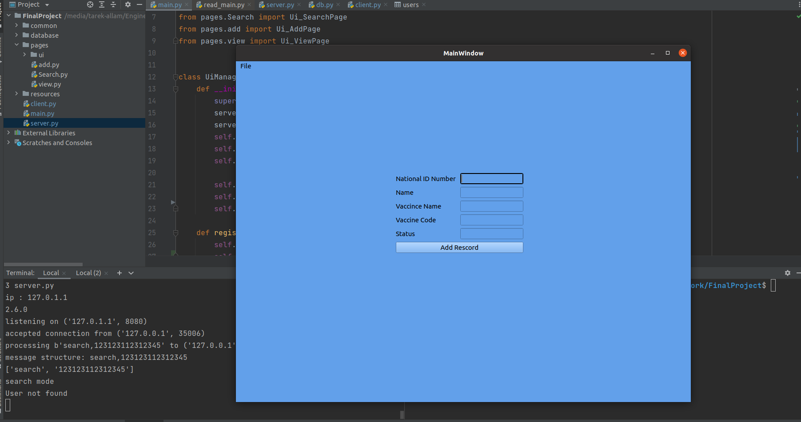
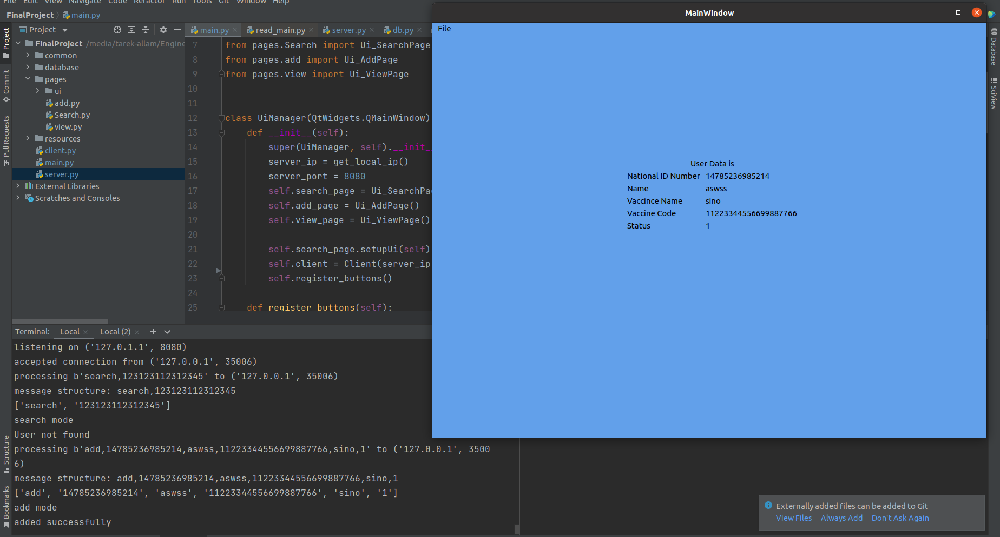
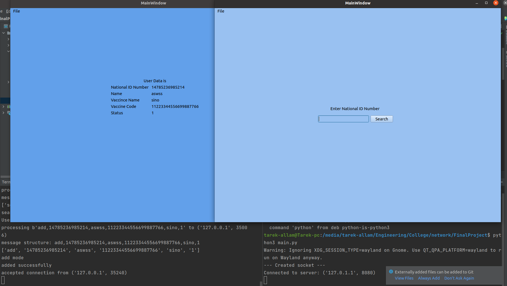
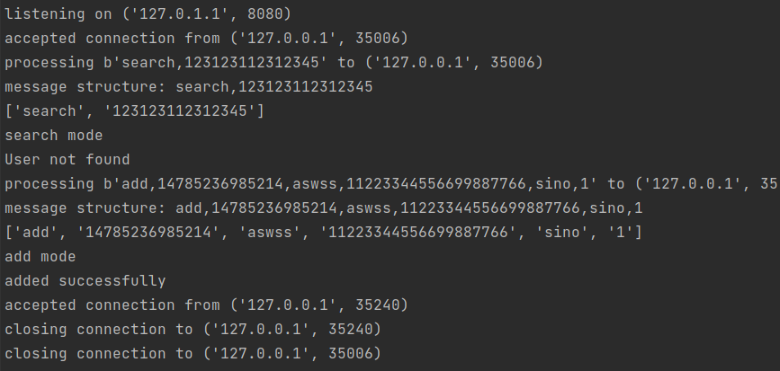

# Server-Client  vaccine data entry

final project of computer networking class.

### screen shoots from Application user interface

### Initiate connection with three-way hand-shake

### intiate connection with Home Page Search for a record

### New record

### View saved record

### multi-tcp-conections

### chat loop deals with the database, socket states, while the connections in sessions

## extra feature added and methods

1. socket programming (TCP)
2. Handlling MultiClient Server Communication
3. sqllite3 for database management
4. simple graphical user interface for the data record

## how to use

First make sure you have requirements `pip install -r requirements.txt`

The client runs the server code in terminal  `python server.py`
then run the client code `python client.py`

## Sequence of Sockets Communication

